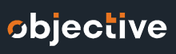

<h1 align="center">
  
</h1>

<h1 align="center">
    Objective Onboarding Unit Tests
</h1>
<p align="center">Project create during the objective onboarding 🚀</p>

## About this project

This project was made during my second week at objective. This is the code made during the 
test automation course.
In this course you will learn about unit testing, SOLID and little about clean architecture.

---

## Technologies 👩‍💻

Thecnologies used in this project

- [TypeScript](https://www.typescriptlang.org/)
- [Jest](https://jestjs.io/)

---

## Requirements

It is necessary to have installed on your machine

- [Git](https://git-scm.com/)
- [Node](https://nodejs.org/en/)
- [npm](https://www.npmjs.com/)


## Starting 🚀

```bash
# Clone this project
$ git clone https://github.com/Artur-Ceschin/ignews.git

# Access
$ cd unit-test

# Install dependencies
$ npm install

# Run tests
$ npm test

```

---

## License📃

This project is under license from MIT. For more details, see the [LICENSE](./LICENSE.md) file.

### Author

---

Made with ❤️ by Artur Ceschin, Please fell free to contact me!
<br/>
[](https://www.linkedin.com/in/artur-peres-ceschin-programador/)
[](mailto:artur.ceschin@gmail.com)
